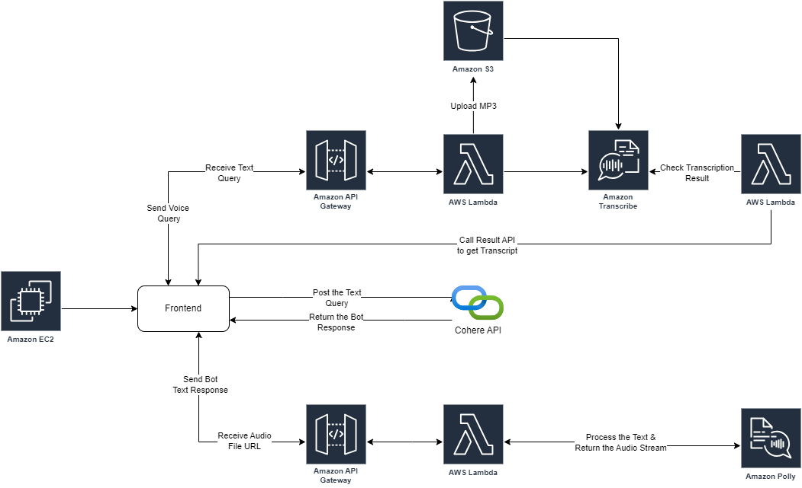

# CLOUD JARVIS

Author:
Rahul Hambarde (rahulhambarde300@gmail.com)

## Introduction
I have developed a system like Jarvis [1], which allows users to interact with an AI model via microphone input and receive responses in a human-like voice. For LLM model, the system utilizes the Cohere API [2] to manage costs effectively.
Target Users
The application is designed for any computer-literate individual, including programmers, who seek a conversational AI interface.
Performance and Response Times
The frontend application is optimized for performance and operates efficiently as it is deployed in a production environment on an EC2 instance [3]. The Cohere API [2] provides rapid responses within milliseconds, and AWS Polly [4] generates and returns audio responses within seconds.
Current Limitations
A notable limitation of the current architecture is the use of AWS Transcribe [5]. The transcription process can be time-consuming, leading to delays while the frontend application polls for transcription results via a Lambda [6] function. This latency affects the overall user experience.

## Final architecture
Below figure shows the final architecture of my application.

## Services
I have utilized following services in my project:
1.  Cohere API [2]
2.	Amazon EC2 [3]
3.	AWS Lambda [6]
4.	Amazon S3 [7]
5.	Amazon API gateway [8]
6.	Amazon Transcribe [5]
7.	Amazon Polly [4]

# Deployment Model
The chosen deployment model for the project is the public cloud [15], specifically utilizing Amazon Web Services (AWS). This decision was made for several reasons:
1.	Scalability: The public cloud offers great scalability, allowing the application to handle varying loads without any manual intervention.
2.	Cost Efficiency: Public cloud services operate on a pay-as-you-go model. This flexibility allows for efficient cost management, especially for a project that has varying levels of demand.
3.	Ease of Management: The public cloud provides a wide array of managed services, such as Amazon S3 [7] for storage and Amazon API Gateway [8] for API management, which reduce the need for manual infrastructure maintenance. This allowed me to focus on building the features rather than maintaining the infrastructure.

## Delivery Model
The chosen delivery model for the project is Software as a Service (SaaS) [16]. This model was selected for the following reasons:
1.	Accessibility and Convenience: SaaS applications are accessible over the internet, allowing users to access the service from any device with a web browser. As this eliminates the need for local installations or complex configurations users can conveniently access the chatbot.
2.	Scalability and Flexibility: SaaS solutions are designed to scale easily, accommodating varying numbers of users and workloads. This flexibility allows the application to handle increased demand without requiring significant changes to the underlying infrastructure.
3.	Integration Capabilities: SaaS applications can be designed to integrate easily with other cloud-based services and APIs. This capability facilitates the incorporation of additional features and functionalities, such as AI and machine learning services.

## Component Structure
1. Frontend Deployment:
•	EC2 Instance [3]: The React frontend is containerized and deployed on an EC2 [3] instance. The instance runs a Docker container hosting the frontend application.
•	Nginx [18]: It redirects HTTP traffic to HTTPS and proxies HTTPS requests to the Docker container running the React application.
2. Backend Services:
•	API Gateway [8]: It routes requests to the appropriate AWS Lambda [6] functions for processing.
•	Lambda Functions [6]: Three Lambda functions [6] handle different aspects of the application's backend logic:
o	transcribeAudioQuery: Handles audio transcription requests by uploading audio files to an S3 [7] bucket and starting an AWS Transcribe [5] job.
o	getTranscriptionResult: Retrieves the results of a transcription job from AWS Transcribe [5] by polling from frontend.
o	synthesizeSpeech: Uses AWS Polly [4] to synthesize speech from text, generating an audio response.
3. AWS Transcribe [5] & Polly [4] Integration:
•	Transcribe [5]: Converts audio input into text. The Lambda function transcribeAudioQuery initiates a transcription job by uploading audio to an S3 [7] bucket and invoking AWS Transcribe [5].
•	Polly [4]: Converts text into speech. The synthesizeSpeech Lambda function [6] uses AWS Polly [4] to generate spoken responses.
4. Data Storage and Management:
•	S3 Bucket [7]: Used to store audio files and transcription results. The bucket jarvis-transcriptions is where audio files are uploaded for transcription and where the results are stored.
5. Security and Access Control:
•	IAM Roles [19]: Grant necessary permissions for the Lambda functions [6] to access other AWS services like S3 [7], Transcribe [5], and Polly [4].
•	Security Groups: Control inbound and outbound traffic to the EC2 instance, allowing HTTP, HTTPS, and SSH access.

# Workflow and User Interaction:
1.	User Interaction: A user interacts with the React frontend, using mic to record an audio and which will upload it to S3 [7] and will get response from cohere in both text and audio format.
2.	API Request: The frontend sends a request to the API Gateway [8].
3.	Backend Processing:
o	For Transcription: The API Gateway routes the request to the transcribeAudioQuery Lambda function, which processes the audio and starts a transcription job. The frontend can poll for transcription results using getTranscriptionResult.
o	For Speech Synthesis: The frontend sends text to the synthesizeSpeech function, which generates an audio response using Polly [4].
4.	Response Delivery: The results (transcription or synthesized speech) are returned to the frontend via the API Gateway [8], and the React app [20] displays and plays them for the user.
This architecture provides a scalable, serverless backend for handling AI-driven features (like transcription and speech synthesis) and a responsive frontend for user interaction.

## Where is data stored?
The data is stored in an S3 [7] bucket.
What programming languages did you use (and why) and what parts of your application required code?
I am using JavaScript as the primary programming language for this project. JavaScript is used due to its versatility in developing both the frontend application (using React [20]) and backend components (such as AWS Lambda functions [6]). The frontend application, built with React [20], and the backend functionality, including Lambda functions [6] for audio-to-text and text-to-speech conversion required code.
How is your system deployed to the cloud?
The deployment process involves creating a Docker [21] image on my local machine and pushing this image to Docker Hub. The image is then pulled from Docker Hub onto an Amazon EC2 [3] instance where it is deployed using Docker. Nginx [18] is used to manage web server functionality, and a self-signed certificate is used to enable HTTPS for secure communication. Due to the limitations of the free tier on my personal AWS account, where only t2.micro [22] instances are supported, and the t2.micro [22] instance's insufficient capacity to handle the build process for React [20] applications and image creation, this approach is necessary for deployment.

 
## Future Improvements
If I were to proceed with the development of this app, I would work on below improvements:
1. Enhanced Natural Language Understanding (NLU)
•	Feature: Improve the chatbot's ability to understand and respond to more complex queries and context.
•	Cloud Mechanism: Amazon Lex [24] or AWS Comprehend [25] for natural language processing and sentiment analysis.
2. Integration with External APIs
•	Feature: Allow the chatbot to fetch and provide information from external sources, such as weather updates, news, or social media.
•	Cloud Mechanism: AWS Lambda [6] and API Gateway [8] for serverless API integration.
3. Multilingual Support
•	Feature: Enable the chatbot to understand and respond in multiple languages.
•	Cloud Mechanism: Amazon Translate [26] for translation services, combined with AWS Polly [4] for speech synthesis in different languages.
4. Personalization and User Profiles
•	Feature: Personalize interactions based on user preferences and history.
•	Cloud Mechanism: AWS Cognito [27] for user authentication and profile management, DynamoDB [12]/S3 [7] for storing user preferences and interaction history.
5. Image Recognition and Analysis
•	Feature: Extend functionality to include image recognition, allowing users to upload images for analysis and information retrieval.
•	Cloud Mechanism: Amazon Rekognition [28] for image and video analysis.

## Built With

* [AWS](https://aws.amazon.com) - All the services available
* [Cohere](https://cohere.com/) - LLM API
* [Node.js](https://nodejs.org/) - JavaScript runtime
* [Express.js](https://expressjs.com/) - Web application framework for Node.js
* [MongoDB](https://www.mongodb.com/) - NoSQL database

## Acknowledgments

- Design is inspired by [JARVIS](https://marvelcinematicuniverse.fandom.com/wiki/J.A.R.V.I.S) from marvel cinematic.
- The amazing api for LLM model was provided by [Cohere](https://cohere.com/).
- Created React application using template [create-react-app](https://create-react-app.dev/docs/getting-started)
- Used [Material-UI](https://v4.mui.com/getting-started/installation/) components and icons
- Used [typewriter-effect](https://www.npmjs.com/package/typewriter-effect) to animate text
- Hats off to the Medium.com and Stackoverflow.com community for providing useful tutorials and solutions

## References
[1]	    “J.A.R.V.I.S,” Marvel Cinematic Universe Wiki. [Online]. Available: https://marvelcinematicuniverse.fandom.com/wiki/J.A.R.V.I.S. [Accessed: Jul 15, 2024].

[2]	    “Cohere,” Cohere. [Online]. Available: https://cohere.com/. [Accessed: Jul 15, 2024].

[3]	    “Amazon EC2,” Amazon.com. [Online]. Available: https://aws.amazon.com/ec2/. [Accessed: Jul 15, 2024].

[4]	    “Amazon Polly,” Amazon.com. [Online]. Available: https://aws.amazon.com/polly/. [Accessed: Jul 15, 2024].

[5] 	“Amazon Transcribe,” Amazon.com. [Online]. Available: https://aws.amazon.com/transcribe/. [Accessed: Jul 15, 2024].

[6]	    “Amazon Lambda,” Amazon.com. [Online]. Available: https://aws.amazon.com/lambda/. [Accessed: Jul 15, 2024].

[7]	    “Amazon S3,” Amazon.com. [Online]. Available: https://aws.amazon.com/s3/. [Accessed: Jul 15, 2024].

[8]	    “Amazon Api Gatway,” Amazon.com. [Online]. Available: https://aws.amazon.com/api-gateway/. [Accessed: Jul 15, 2024].

[9]	    “Amazon Elastic Block Store,” Amazon.com. [Online]. Available: https://aws.amazon.com/ebs/. [Accessed: Jul 15, 2024].

[10]	“Amazon Elastic Container Service,” Amazon.com. [Online]. Available: https://aws.amazon.com/ecs/. [Accessed: Jul 15, 2024].

[11]	“Amazon Elastic Kubernetes Service,” Amazon.com. [Online]. Available: https://aws.amazon.com/eks/. [Accessed: Jul 15, 2024].

[12]	“Amazon Dynamo DB,” Amazon.com. [Online]. Available: https://aws.amazon.com/dynamodb/. [Accessed: Jul 15, 2024].

[13]	“Amazon Relational Database Service,” Amazon.com. [Online]. Available: https://aws.amazon.com/rds/. [Accessed: Jul 15, 2024].

[14]	“Web Audio API,” MDN Web Docs. [Online]. Available: https://developer.mozilla.org/en-US/docs/Web/API/Web_Audio_API. [Accessed: Jul 15, 2024].

[15]	“Cloud Deployment Model,” Sciencedirect.com. [Online]. Available: https://www.sciencedirect.com/topics/computer-science/cloud-deployment-model. [Accessed: Jul 15, 2024].

[16]	“What is Software as a Service (SaaS)?,” Salesforce. [Online]. Available: https://www.salesforce.com/ca/saas/. [Accessed: Jul 15, 2024].

[17]	“Flowchart maker & online diagram software,” Diagrams.net. [Online]. Available: https://app.diagrams.net/. [Accessed: Jul 15, 2024].

[18]	“nginx,” Nginx.org. [Online]. Available: https://nginx.org/en/. [Accessed: Jul 15, 2024].

[19]	“Amazon Identity Access Management,” Amazon.com. [Online]. Available: https://aws.amazon.com/iam/. [Accessed: Jul 15, 2024].

[20]	“React,” React.dev. [Online]. Available: https://react.dev/. [Accessed: Jul 15, 2024].

[21]	S. Ratliff, “Docker: Accelerated container application development,” Docker, 10-May-2022. [Online]. Available: https://www.docker.com/. [Accessed: Jul 15, 2024].

[22]	“Amazon EC2 Instance Types,” Amazon.com. [Online]. Available: https://aws.amazon.com/ec2/instance-types/t2/. [Accessed: Jul 15, 2024].

[23]	“Configuring HTTPS servers,” Nginx.org. [Online]. Available: https://nginx.org/en/docs/http/configuring_https_servers.html. [Accessed: Jul 15, 2024].

[24]	“Amazon Lex,” Amazon.com. [Online]. Available: https://aws.amazon.com/lex/. [Accessed: Jul 15, 2024].

[25]	“Amazon Comprehend,” Amazon.com. [Online]. Available: https://aws.amazon.com/comprehend/. [Accessed: Jul 15, 2024].

[26]	“Amazon Translate,” Amazon.com. [Online]. Available: https://aws.amazon.com/translate/. [Accessed: Jul 15, 2024].

[27]	“Amazon Cognito,” Amazon.com. [Online]. Available: https://aws.amazon.com/cognito/. [Accessed Jul 15, 2024].

[28]	“Amazon Rekognition,” Amazon.com. [Online]. Available: https://aws.amazon.com/rekognition/. [Accessed: Jul 15, 2024].

[29]	Linux.org. [Online]. Available: https://www.linux.org/. [Accessed Jul 15, 2024].

[30]	“VMware - delivering a digital foundation for businesses,” Vmware.com. [Online]. Available: https://www.vmware.com/. [Accessed: Jul 15, 2024].

[31]	“Introduction to Hyper-V on windows 10,” Microsoft.com. [Online]. Available: https://learn.microsoft.com/en-us/virtualization/hyper-v-on-windows/about/. [Accessed: Jul 15, 2024].

[32]	“Production-Grade Container Orchestration,” Kubernetes.io. [Online]. Available: https://kubernetes.io/. [Accessed: Jul 15, 2024].

[33]	“Openshift Docs,” Openshift.com. [Online]. Available: https://docs.openshift.com/. [Accessed: Jul 15, 2024].

[34]	“SQL Server downloads,” Microsoft.com. [Online]. Available: https://www.microsoft.com/en-ca/sql-server/sql-server-downloads. [Accessed: Jul 15, 2024].

[35]	Mysql.com. [Online]. Available: https://www.mysql.com/. [Accessed: Jul 15, 2024].

[36]	“PostgreSQL,” PostgreSQL. [Online]. Available: https://www.postgresql.org/. [Accessed: Jul 15, 2024].

[37]	“MongoDB: The developer data platform,” MongoDB. [Online]. Available: https://www.mongodb.com/. [Accessed: Jul 15, 2024].

